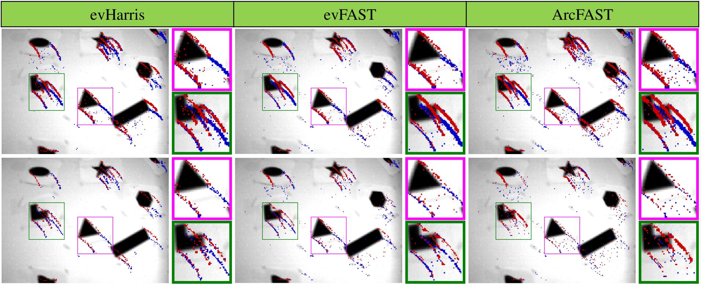

# ANMS
ANMS: Asynchronous Non-Maximum Suppression in Event Stream.

## Result

## Setup
TBD.

## The DAVIS240C Dataset
1. shapes_6dof.bag

## Other Dataset
For example, [MVSEC](https://daniilidis-group.github.io/mvsec/)
1. Set all `sensor_width` and `sensor_height` to `346` and `260` in the code under the `include/ANMS_detector` directory.
2. When play the rosbag, change the topic of the message: 
`rosbag play mvsec.bag /davis/left/camera_info:=/dvs/camera_info /davis/left/events:=/dvs/events /davis/left/image_raw:=/dvs/image_raw /davis/left/imu:=/dvs/imu`

## Acknowledgements

[evHarris and evFAST](https://github.com/uzh-rpg/rpg_corner_events)

[ArcFAST](https://github.com/ialzugaray/arc_star_ros)

[FA-Harris](https://github.com/ruoxianglee/fa_harris)
