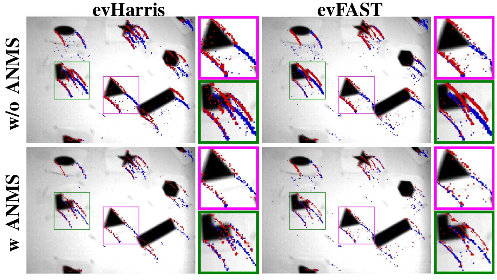
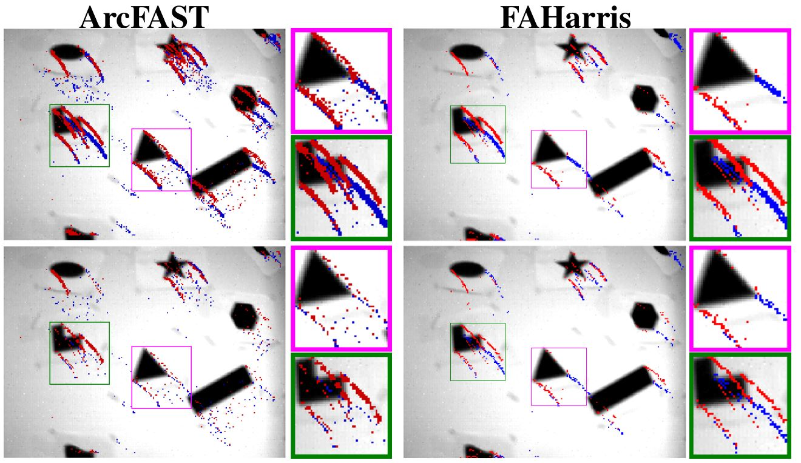
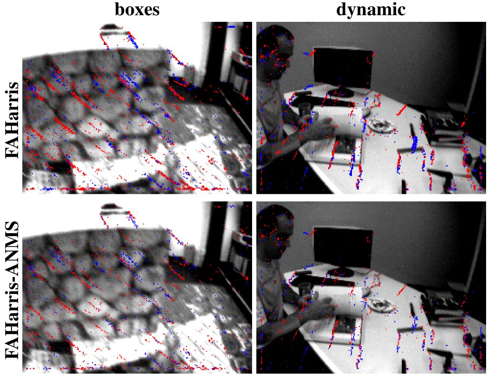
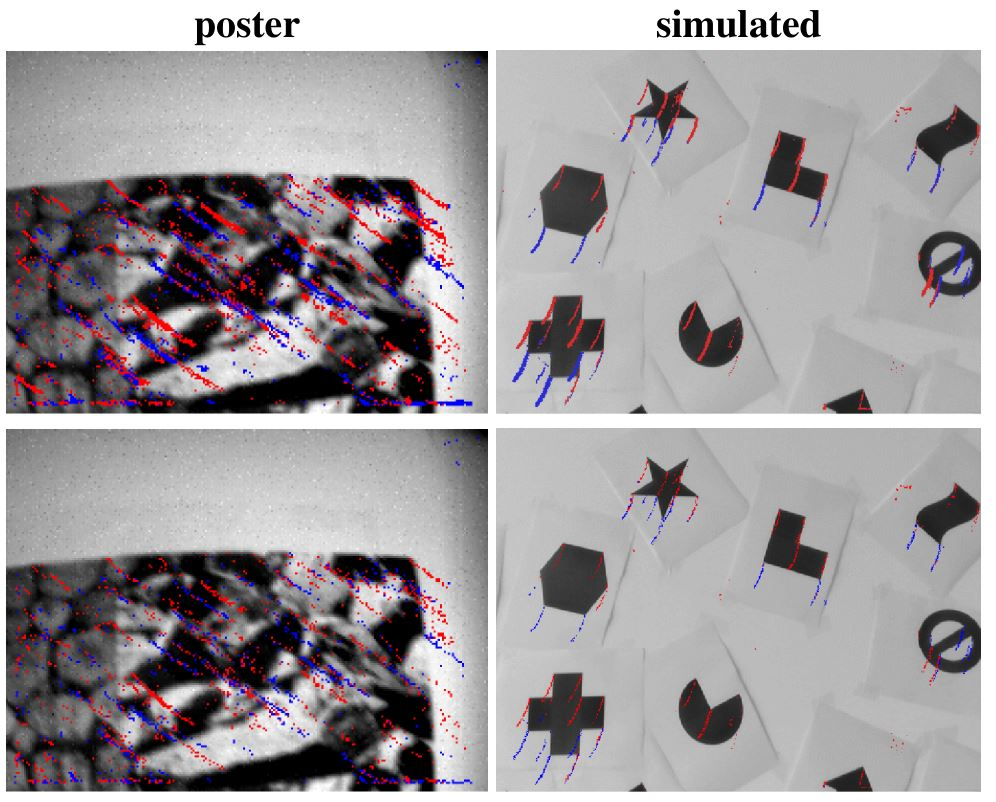

# ANMS
ANMS: Asynchronous Non-Maximum Suppression in Event Stream.

## Result
<table>
  <tr>
    <td></td>
    <td></td>
  </tr>
</table>
<table>
  <tr>
    <td></td>
    <td></td>
  </tr>
</table>

## Setup
TBD.

## The DAVIS240C Dataset
1. Setting the sensor size (240,180).
2. rosbag play shapes_6dof.bag

## The simulated Dataset
Simulation by DVS-Voltmeter
1. Setting the sensor size.
2. Read the txt file and publish ros messages by python.

## Other Dataset
For example, [MVSEC](https://daniilidis-group.github.io/mvsec/)
1. Set all `sensor_width` and `sensor_height` to `346` and `260`.
2. When play the rosbag, change the topic of the message: 
`rosbag play mvsec.bag /davis/left/camera_info:=/dvs/camera_info /davis/left/events:=/dvs/events /davis/left/image_raw:=/dvs/image_raw /davis/left/imu:=/dvs/imu`

## Acknowledgements

[evHarris and evFAST](https://github.com/uzh-rpg/rpg_corner_events)

[ArcFAST](https://github.com/ialzugaray/arc_star_ros)

[FA-Harris](https://github.com/ruoxianglee/fa_harris)
